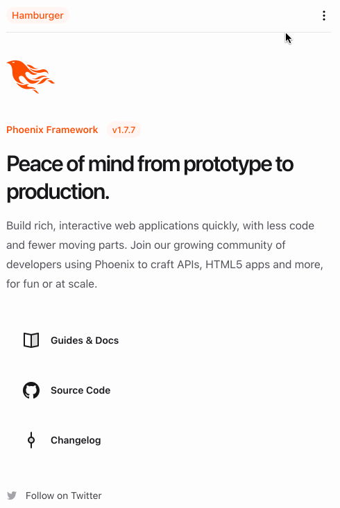

Long time, no blog! Anyways, I've been messing around with Elixir and Phoenix
for a [side project around managing some chess
tournaments](https://github.com/bsmithgall/elswisser). Since I plan on
occasionally managing the application from my phone, I needed a way to handle
collapsing navigation at a different viewport. I ended up using the classic
[hamburger menu](https://en.wikipedia.org/wiki/Hamburger_button) implemented
using Phoenix 1.7's new
[components](https://www.phoenixframework.org/blog/phoenix-1.7-final-released).

I have been enjoying working with Elixir and Phoenix, though is quite a
different way of thinking about problems and how to organize code, and I am
certainly no expert, but I liked this approach.

Here's a short gif of the component dropped on top of a freshly generated
Phoenix application (generated via `mix phx.new --no-ecto hamburger`):



And here is the full component's code:

```plain
defmodule HamburgerWeb.Topnav do
  import HamburgerWeb.CoreComponents, only: [icon: 1]
  use Phoenix.Component
  alias Phoenix.LiveView.JS

  def nav(assigns) do
    ~H"""
    <header class="px-4 z-40 sticky bg-white">
      <div class="flex items-center justify-between border-b border-gray-200 text-sm py-3 z-40">
        <p class="bg-brand/5 text-brand rounded-xl px-2 font-medium leading-6">
          Hamburger
        </p>
        <.hamburger_button />
        <.top_nav_content />
      </div>
      <.open_hamburger />
    </header>
    """
  end

  defp top_nav_content(assigns) do
    ~H"""
    <div class="hidden md:flex md:items-center md:gap-4 font-semibold leading-6">
      <a href="/" class="hover:text-zinc-500">
        Home
      </a>
    </div>
    """
  end

  defp hamburger_button(assigns) do
    ~H"""
    <div class="md:hidden">
      <button phx-click={show_hamburger()}>
        <.icon name="hero-ellipsis-vertical-mini" />
      </button>
    </div>
    """
  end

  defp open_hamburger(assigns) do
    ~H"""
    <div id="hamburger-container" class="hidden relative z-50">
      <div id="hamburger-backdrop" class="fixed inset-0 bg-zinc-50/90 transition-opacity"></div>
      <nav
        id="hamburger-content"
        class="fixed top-0 left-0 bottom-0 flex flex-col grow justify-between w-3/4 max-w-sm py-6 bg-white border-r overflow-y-auto"
      >
        <div>
          <div class="flex items-center mb-4 place-content-between mx-4 border-b-zinc-200">
            <div class="flex items-center gap-4">
              <p class="bg-brand/5 text-brand rounded-xl px-2 font-medium leading-6">
                Hamburger
              </p>
            </div>
            <button class="navbar-close" phx-click={hide_hamburger()}>
              <.icon name="hero-x-mark-mini" />
            </button>
          </div>
          <div>
            <ul></ul>
            <li class="block px-6 py-2 text-sm font-semibold hover:bg-gray-200" phx-click="/">
              <a href="/">Home</a>
            </li>
          </div>
        </div>
      </nav>
    </div>
    """
  end

  defp show_hamburger(js \\ %JS{}) do
    js
    |> JS.show(
      to: "#hamburger-content",
      transition:
        {"transition-all transform ease-in-out duration-300", "-translate-x-3/4", "translate-x-0"},
      time: 300,
      display: "flex"
    )
    |> JS.show(
      to: "#hamburger-backdrop",
      transition:
        {"transition-all transform ease-in-out duration-300", "opacity-0", "opacity-100"}
    )
    |> JS.show(
      to: "#hamburger-container",
      time: 300
    )
    |> JS.add_class("overflow-hidden", to: "body")
  end

  defp hide_hamburger(js \\ %JS{}) do
    js
    |> JS.hide(
      to: "#hamburger-backdrop",
      transition: {"transition-all transform ease-in duration-200", "opacity-100", "opacity-0"}
    )
    |> JS.hide(
      to: "#hamburger-content",
      transition:
        {"transition-all transform ease-in duration-200", "translate-x-0", "-translate-x-3/4"}
    )
    |> JS.hide(to: "#hamburger-container", transition: {"block", "block", "hidden"})
    |> JS.remove_class("overflow-hidden", to: "body")
  end
end
```

Here's how it works in a bit more detail: In the top navigation, there are three
separate sections: 

1. The "Logo" section, which always appears.
2. The top navigation, which will appear in viewports greater than whatever
   the `md:` breakpoint is set as (for more, see [Tailwind media query
   documentation](https://tailwindcss.com/docs/responsive-design)). Phoenix
   1.7 ships with Tailwind by default.
3. The hamburger button, which is `display: hidden` at larger viewports and
   visible at smaller ones.

The hamburger button has a `phx-click` listener on it. This is a nice addition
in Phoenix to allow for server-generated files to have some basic client-side
capabilities. When the button is clicked, the `show_hamburger/1` method is
called. This method dispatches a handful of [`JS.show/1`
events](https://hexdocs.pm/phoenix_live_view/Phoenix.LiveView.JS.html#show/1) to
the different parts of the side navigation. The side navigation portion of the
hamburger menu is also made up of three components, each of which gets a
different show transition applied to them:

1. The actual content of the sidenav, which slides in from the left via an
   [`ease-in-out`
   transition](https://developer.mozilla.org/en-US/docs/Web/CSS/transition-timing-function#try_it).
   The actual transition slides by translating the element from offscreen by the
   inverse of its width to 0, meaning that it will slide in to the right until
   the final left edge of the element is at position 0.
2. A background which gets dropped over the rest of the page. This transitions
   from `opacity-0` (totally invisible) to `opacity-100` (totally visible). 
3. A wrapper element which initially starts out as hidden. This immediately
   becomes visible to allow the children elements (outlined above) to transition
   into view.

The contents also contain a little `x` icon, which triggers hiding the contents
by basically replaying the steps in reverse.

That's the main portion of this component. It's pretty straightforward to extend
this by dropping additional pieces into [slots](https://hexdocs.pm/phoenix_live_view/Phoenix.Component.html#module-slots).