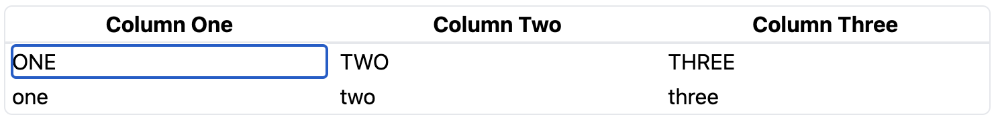
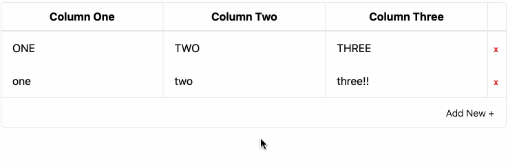
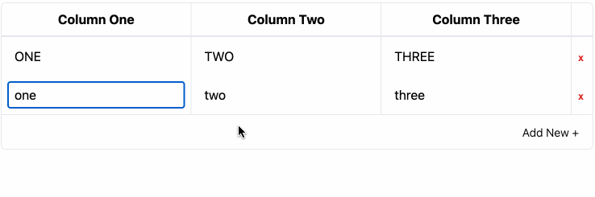
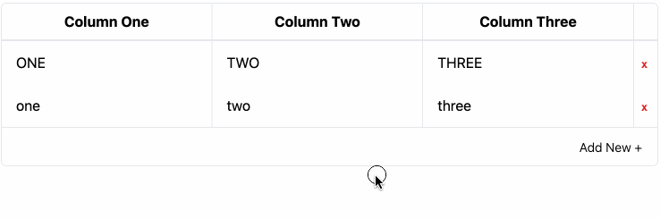

I have been messing around a bit with NextJS for a little side project. The main
interface in the project have been editable data tables (or, `<td>` elements
with `<input>` slapped in the middle). For whatever reason, I ended up using the
[`tanstack/react-table` library](https://tanstack.com/table/latest) as the core
building block.

After using these tables for a few weeks, I wanted to make a small change: after
adding a new role to a given table, I wanted to focus on the first column of the
newly created row.

The first two parts of this post go over some Tanstack table basics: setting up
editable table cells and adding/removing rows. If you want to skip right on over
to the focusing bit, you can find that in Step 3 below. The full working example
is available in
[this repository](https://github.com/bsmithgall/tanstack-focus-ref).

Let's start with something that looks very similar to the
[basic tanstack table](https://tanstack.com/table/v8/docs/framework/react/examples/basic):

```jsx
import * as React from "react";
import {
  createColumnHelper,
  flexRender,
  getCoreRowModel,
  useReactTable,
} from "@tanstack/react-table";

const helper = createColumnHelper();

const columns = [
  helper.accessor("one", { header: "Column One" }),
  helper.accessor("two", { header: "Column Two" }),
  helper.accessor("three", { header: "Column Three" }),
];

const defaultData = [
  { one: "ONE", two: "TWO", three: "THREE" },
  { one: "one", two: "two", three: "three" },
];

function App() {
  const [data, setData] = React.useState(defaultData);

  const table = useReactTable({
    data,
    columns,
    getCoreRowModel: getCoreRowModel(),
  });

  return (
    <div className="border m-2 rounded-md relative">
      <table className="w-full overflow-auto">
        <thead className="border-b-2">
          {table.getHeaderGroups().map((group) => (
            <tr key={group.id}>
              {group.headers.map((header) => (
                <th key={header.id} className="py-2 border-1 first:border-0">
                  {flexRender(
                    header.column.columnDef.header,
                    header.getContext()
                  )}
                </th>
              ))}
            </tr>
          ))}
        </thead>
        <tbody>
          {table.getRowModel().rows.map((row) => (
            <tr key={row.id} className="mt-4">
              {row.getVisibleCells().map((cell) => (
                <td key={cell.id} className="p-2 border-1 first:border-0">
                  {flexRender(cell.column.columnDef.cell, cell.getContext())}
                </td>
              ))}
            </tr>
          ))}
        </tbody>
      </table>
    </div>
  );
}

export default App;
```

Aside from a small difference in the data model and the inclusion of Tailwind,
this is very similar to the example.

# Step 1: making the inputs editable

Tanstack allows you to pass a `cell` when defining your columns, which lets us
have control over how a given cell is rendered
([docs](https://tanstack.com/table/v8/docs/guide/column-defs#column-formatting--rendering)).
This lets us write a custom component for handling cell inputs. This component
takes in props defined by Tanstack itself.

Here's something to get started with:

```jsx
function EditableCellInput({ getValue, row, column, table }) {
  const [value, setValue] = React.useState(getValue());

  return (
    <input
      className="table-cell w-full px-2 py-1"
      value={value}
      onChange={(e) => setValue(e.target.value)}
      onBlur={() => table.options.meta.updateRow(row.index, column.id, value)}
    />
  );
}
```

This is mostly normal React form state management. The only interesting thing to
comment on is the `onBlur` handler, which hooks back into the overall Tanstack
table. Tanstack has a notion of a "table meta" which lets you attach arbitrary
bits and pieces to your table definition and then access them later. We can add
this into our `useReactTable` definition from the top:

```jsx
const table = useReactTable({
  data,
  columns,
  getCoreRowModel: getCoreRowModel(),
  meta: {
    updateRow: (rowIdx, columnId, value) => {
      setData((data) =>
        data.map((row, idx) =>
          idx === rowIdx ? { ...row, [columnId]: value } : row
        )
      );
    },
  },
});
```

At this point, we need to modify our column definitions to have them render the
new custom cell component. Note that this component is actually the result of
that
[`flexRender()`](https://tanstack.com/table/v8/docs/api/core/cell#getcontext)
call, which means that the result will appear inside of the `<td>`:

```jsx
const columns = [
  helper.accessor("one", { header: "Column One", cell: EditableCellInput }),
  helper.accessor("two", { header: "Column Two", cell: EditableCellInput }),
  helper.accessor("three", { header: "Column Three", cell: EditableCellInput }),
];
```

Here's what we should end up with:



# Step 2: adding and removing rows

## Adding new row

Now we need to be able to add and remove rows from our table. To add a new row,
we'll want to add a table footer which includes a button to add a row, along
with a new table meta method to push that new row into the bottom of our state.

First, let's add the footer:

```jsx
function App() {
  // ...
  return (
    // ...
    <tfoot className="border-t">
      <tr>
        <th colSpan={table.getCenterLeafColumns().length}>
          <div className="float-right mr-4 my-2">
            <button
              className="text-sm font-light"
              onClick={table.options.meta.addRow}
            >
              Add New +
            </button>
          </div>
        </th>
      </tr>
    </tfoot>
    // ...
  );
}
```

Now, let's add the `addRow` function to our table definition:

```jsx
const table = useReactTable({
  // ...
  meta: {
    addRow: () => {
      setData((data) => [...data, { one: "", two: "", three: "" }]);
    },
    updateRow: (rowIdx, columnId, value) => {...},
  },
})
```

This function updates the internal table's `data` state to include a new row of
all blanks.

## Removing a row

In order to remove a row, we will add a [display column]() which will serve as a
button that, when clicked, will trigger a new `removeRow` method from the table
meta, similar to `addRow` above.

First, let's add a component to serve as the remove button:

```jsx
function RemoveButton({ row, table }) {
  return (
    <button
      className="font-mono font-semibold text-red-600 text-xs align-middle"
      onClick={() => table.options.meta.removeRow(row.index)}
    >
      x
    </button>
  );
}
```

Just like the `EditableCellInput`, this table will receive props from tanstack
directly, allowing us to reference the table and row object.

Next, let's use that component to add a new display column:

```jsx
const columns = [
  helper.accessor("one", { header: "Column One", cell: EditableCellInput }),
  helper.accessor("two", { header: "Column Two", cell: EditableCellInput }),
  helper.accessor("three", { header: "Column Three", cell: EditableCellInput }),
  helper.display({ id: "remove", cell: RemoveButton }),
];
```

Finally, let's add in the new method to the table meta:

```jsx
const table = useReactTable({
  // ...
  meta: {
    addRow: () => {...},
    updateRow: (rowIdx, columnId, value) => {...},
    removeRow: (rowIdx) => {
      setData((data) => data.filter((_, idx) => idx !== rowIdx));
    },
  },
})
```

Here's a gif of everything so far:



# Step 3: auto-focus new rows when added

Finally, we get to the whole point of this post.

## Refs

Refs are mutable properties that get attached to components but don't cause
re-renders when they are changed. According to the
[documentation](https://react.dev/learn/referencing-values-with-refs):

> When you want a component to “remember” some information, but you don’t want
> that information to trigger new renders, you can use a ref.

Managing something like focus is not directly in the purview of React. Instead,
React gives us escape hatches which we can use to tie non-React parts of the
browser ecosystem into the React environment. For our purposes, we will use a
[ref](https://react.dev/learn/manipulating-the-dom-with-refs). The
[first example in the React documentation](https://react.dev/learn/manipulating-the-dom-with-refs#example-focusing-a-text-input)
shows almost precisely what we want to do: click a button to focus an input:

```jsx
import { useRef } from "react";

export default function Form() {
  const inputRef = useRef(null);

  function handleClick() {
    inputRef.current.focus();
  }

  return (
    <>
      <input ref={inputRef} />
      <button onClick={handleClick}>Focus the input</button>
    </>
  );
}
```

However, our use case is more complicated: `ref` is generated via the `useRef`
hook, and hooks are only allowed to be called once per component. Our state,
however, is an array of objects. React's documentation is quite clear here:

> ... Hooks must only be called at the top-level of your component. You can’t
> call useRef in a loop, in a condition, or inside a map() call.

React has a way around this limitation.

## Ref callbacks

The `ref` attribute on a component can take a
[callback function](https://react.dev/reference/react-dom/components/common#ref-callback)
which takes as an argument the DOM node that is attached to the component at
hand. The React documentation has a
[handy example](https://react.dev/learn/manipulating-the-dom-with-refs#how-to-manage-a-list-of-refs-using-a-ref-callback)
of using a ref callback to handle lists by maintaining a separate `Map`.

We can use a similar basic concept, but we have a few additional complications.
First, we'll need to have our `ref` be computed when we draw our table. We can
manage this in the same way as described in the React documentation: we can use
a `Map<string, HTMLElement>` as the type of the value inside of our `ref`, and
then update it using a ref callback.

```jsx
function App() {
  const ref = React.useRef(new Map());
  // ...

  return (
    // ...
    <tbody>
      {table.getRowModel().rows.map((row, rowIdx) => (
        <tr key={row.id} className="mt-4">
          {row.getVisibleCells().map((cell, cellIdx) => (
            <td key={cell.id} className="p-2 border-l first:border-0">
              {flexRender(cell.column.columnDef.cell, {
                ...cell.getContext(),
                cellRef: (node) => {
                  const map = ref.current;
                  if (node) {
                    map.set(`${rowIdx}-${cellIdx}`, node);
                  } else {
                    map.delete(`${rowIdx}-${cellIdx}`);
                  }
                },
              })}
            </td>
          ))}
        </tr>
      ))}
    </tbody>
    // ...
  );
}
```

There are a few changes here worth discussing. First, we establish our new `ref`
with the `useRef` hook, and initialize it's `.current` value to an empty `Map`.
One thing to note is that when calling `.get()` on a map, keys are compared
using `===`, so we aren't able to use an array as our key type, because
`[0, 0] !== [0, 0]`. This is in contract to a language like Python, where we
could use a tuple.

In any case, we next change how the inner contents of a cell are rendered.
Remember in part one we used `flexRender()`? Here, we do the same but instead of
just passing in the cell's context to our component, we also pass a new
`cellRef` prop. This prop has the shape of a ref callback function. Now we have
to change our `EditableCellInput` to know how to handle it:

```jsx
function EditableCellInput({ getValue, row, column, table, cellRef }) {
  // ...
  return (
    <input
      ref={cellRef}
      // ...
    />
  );
}
```

Now, whenever we render the table, any `EditableCellInput` cells that get
rendered will have their attached `<input />` elements show up as values in our
ref variable, and we can get them at-will via a `Map.get`. There are two last
things we need to do: actually focus the element, and make sure to only focus it
when appropriate.

## Focusing as a side-effect

Now that we have our big ref map, we need to focus the appropriate element after
our table renders. This focus is a _possible side effect_ of rendering the
table, based on how the underlying data changed. In order to link these sorts of
side effects with underlying state changes, React offers us the opportunity to
use effects in the aptly named
[`useEffect` hook](https://react.dev/learn/synchronizing-with-effects).

```jsx
function App() {
  // ...
  React.useEffect(() => {
    const node = ref.current.get(`${data.length - 1}-0`);
    if (node) node.focus();
  }, [data]);

  // ...
}
```

Unfortunately, this implementation has a really annoying bug. The effect will
fire _whenever any re-render happens_. This means that when a cell is blurred,
the first column of the last row will always be auto-focused, meaning no other
cells will ever be able to be edited!



To deal with this, we'll need a way to have the `.focus()` called conditionally.
We can manage this with a small additional piece of state:

```jsx
function App() {
  const [shouldFocus, setShouldFocus] = React.useState(false);

  // ...

  React.useEffect(() => {
    if (!shouldFocus) return;

    const node = ref.current.get(`${data.length - 1}-0`);
    if (node) node.focus();
  }, [data, shouldFocus]);

  // ...

  const table = useReactTable({
    data,
    columns,
    getCoreRowModel: getCoreRowModel(),
    meta: {
      addRow: () => {
        setShouldFocus(true)
        setData((data) => [...data, { one: "", two: "", three: "" }]);
      },
      updateRow: (rowIdx, columnId, value) => {
        setShouldFocus(false);
        setData((data) =>
          data.map((row, idx) =>
            idx === rowIdx ? { ...row, [columnId]: value } : row,
          ),
        );
      },
      removeRow: (rowIdx) => {
        setShouldFocus(false)
        setData((data) => data.filter((_, idx) => idx !== rowIdx));
      },
    },
  })

  return (
    // ...
  )
}
```

That should do it. Now, when we click the "Add Data" button on our data table,
we should automatically focus onto the newly created row:



The full working example is available in
[this repository](https://github.com/bsmithgall/tanstack-focus-ref).
