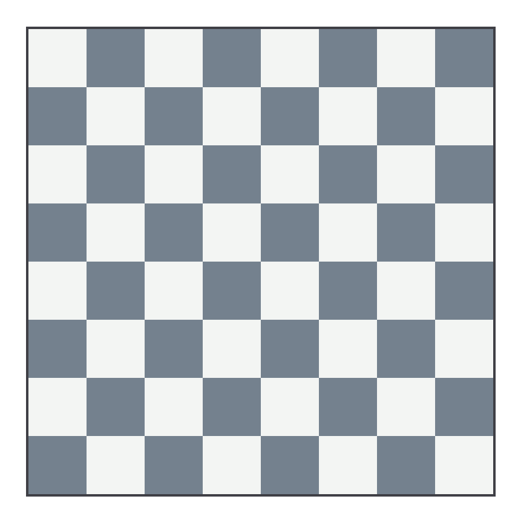
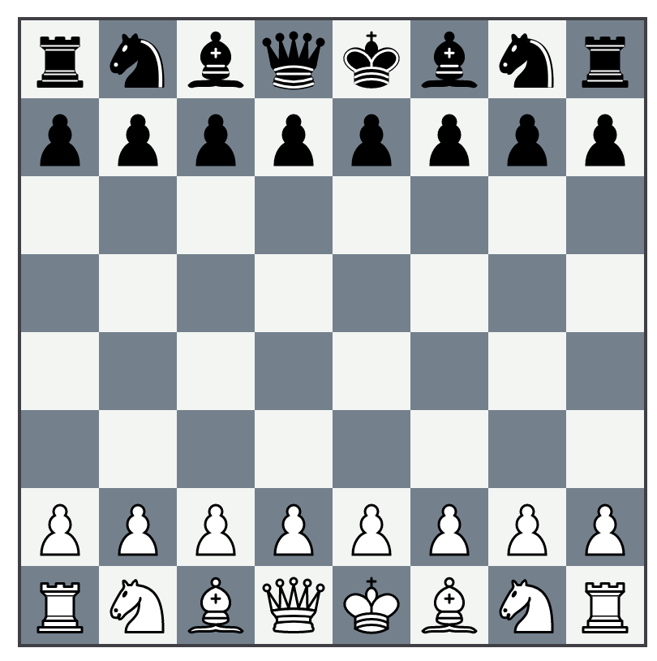
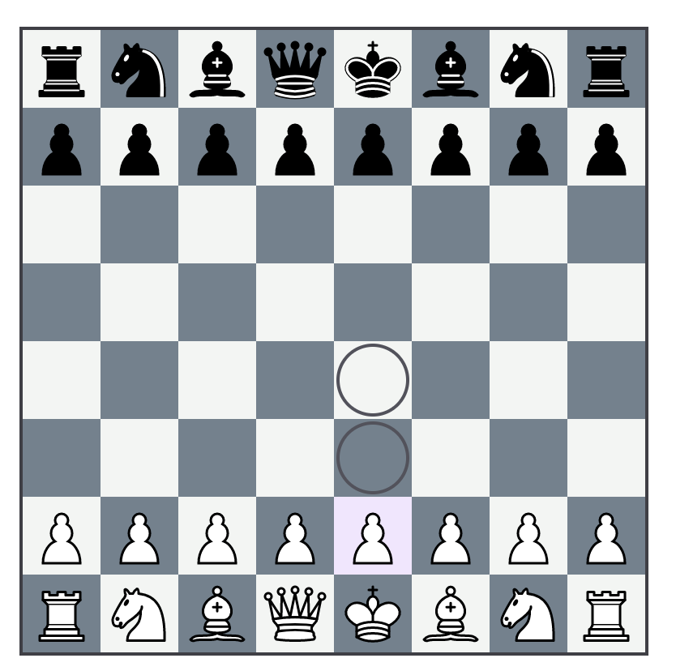
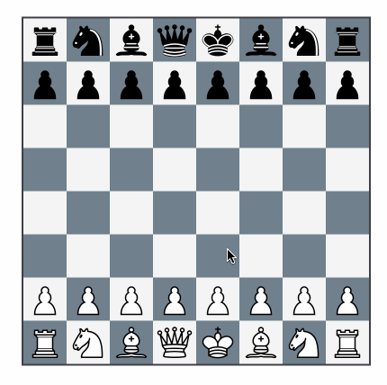

Now that we have a [working
API](../_posts/2024-05-31-live-view-chess-the-rules.md) to create and validate
moves on a chess board, we can go ahead and turn that into a little chess
application using Phoenix LiveView. In this part, we'll get pieces onto a
representation of the board and enable moving them via `phx-click` events. From
there (and possibly in future posts) we can explore other features, like
displaying the game's moves, piece drag and drop, implementing a live game
server, or even generating an engine to play against.

Quick note: syntax highlighting is a [bit broken][broken] for HEEx templates, so
I've disabled it for now. I have a proposed fix but it may take some time to
trickle all the way down to Jekyll and into the blog.

# 1: The board

Before anything else, we'll need an empty board state. Tailwind and CSS grid
make this pretty straightforward:

```
defmodule ElchesserWeb.LiveBoard do
  use ElchesserWeb, :live_view

  def render(assigns) do
    ~H"""
    <div class="w-[388px] m-auto left-0 right-0">
      <div class="border border-2 border-zinc-700 grid grid-rows-8 grid-cols-8">
        <%= for rank <- Elchesser.ranks() |> Enum.reverse() do %>
          <%= for file <- Elchesser.files() do %>
            <div class={["w-12 h-12", background(file, rank)]}></div>
          <% end %>
        <% end %>
      </div>
    </div>
    """
  end

  defp background(file, rank) when rem(file + rank, 2) != 0, do: "bg-boardwhite"
  defp background(_, _), do: "bg-boardblack"

end
```

The main interesting thing going on here is `bg-boardwhite` and `bg-boardblack`
in the `background` function. Tailwind allows for custom colors to be added to
the [theme], so we can go ahead and pick some out so that we can be sure to have
some visual consistency (I am using `#f2f5f3` for `boardwhite` and `#71828f` for
`boardblack`):



# 2. The pieces

Now, we'll need to put some pieces on the board. To start, we'll need some SVG
shapes for the pieces. [These pieces][pieces] from Wikipedia by Colin Burnett
are very well-known and have a friendly license, so those are good to start. 

## Making them accessible as icons

A fresh install of Phoenix 1.7+ comes with a handy `CoreComponents` module,
which includes a bunch of nice functional components for getting started. We can
use the `icon/1` function as inspiration. Let's take a look at how that works:

```elixir
  @doc """
  Renders a [Hero Icon](https://heroicons.com).

  Hero icons come in three styles – outline, solid, and mini.
  By default, the outline style is used, but solid an mini may
  be applied by using the `-solid` and `-mini` suffix.

  You can customize the size and colors of the icons by setting
  width, height, and background color classes.

  Icons are extracted from your `assets/vendor/heroicons` directory and bundled
  within your compiled app.css by the plugin in your `assets/tailwind.config.js`.

  ## Examples

      <.icon name="hero-x-mark-solid" />
      <.icon name="hero-arrow-path" class="ml-1 w-3 h-3 animate-spin" />
  """
  def icon(%{name: "hero-" <> _} = assigns) do
    ~H"""
    <span class={[@name, @class]} />
    """
  end
```

When examining one of the icons in the browser, we see that the `hero-` classes
are registered in tailwind as an svg [mask]:

```js
// tailwind.config.js
module.exports = {
  // ...
  plugins: [
    // ...
    // Embeds Hero Icons (https://heroicons.com) into your app.css bundle
    // See your `CoreComponents.icon/1` for more information.
    //
    plugin(function ({ matchComponents, theme }) {
      let iconsDir = path.join(__dirname, "./vendor/heroicons/optimized");
      let values = {};
      let icons = [
        ["", "/24/outline"],
        ["-solid", "/24/solid"],
        ["-mini", "/20/solid"],
      ];
      icons.forEach(([suffix, dir]) => {
        fs.readdirSync(path.join(iconsDir, dir)).map((file) => {
          let name = path.basename(file, ".svg") + suffix;
          values[name] = { name, fullPath: path.join(iconsDir, dir, file) };
        });
      });
      matchComponents(
        {
          hero: ({ name, fullPath }) => {
            let content = fs
              .readFileSync(fullPath)
              .toString()
              .replace(/\r?\n|\r/g, "");
            return {
              [`--hero-${name}`]: `url('data:image/svg+xml;utf8,${content}')`,
              "-webkit-mask": `var(--hero-${name})`,
              mask: `var(--hero-${name})`,
              "background-color": "currentColor",
              "vertical-align": "middle",
              display: "inline-block",
              width: theme("spacing.5"),
              height: theme("spacing.5"),
            };
          },
        },
        { values },
      );
    }),
  // ...
  ]
}
```

So, when you include a `<.icon name="hero-arrow-path"/>` component, it generates
a `<span></span>` tag that has a mask made up of the contents of the file
located at `./vendor/heroicons/optimized/24/outline/arrow-path.svg`.

We can use this same exact technique to generate similar `<span></span>` tags
that have the contents of our piece SVGs. First, we need to add a new plugin to
our tailwind configuration (this plugin assumes that our piece svgs are stored
in `assets/pieces`):

```js
// tailwind.config.js
module.exports = {
  // ...
  plugins: [
    plugin(function ({ matchComponents, theme }) {
      let piecesDir = path.join(__dirname, "./pieces");
      let values = {};

      let colors = ["white", "black"];

      colors.forEach((color) => {
        fs.readdirSync(path.join(piecesDir, color)).map((file) => {
          let name = `${color}-${path.basename(file, ".svg")}`;
          values[name] = { name, fullPath: path.join(piecesDir, color, file) };
        });
      });

      matchComponents(
        {
          piece: ({ fullPath }) => {
            let content = fs
              .readFileSync(fullPath)
              .toString()
              .replace(/\r?\n|\r/g, "");

            return {
              "background-image": `url('data:image/svg+xml;base64,${Buffer.from(
                content,
              ).toString("base64")}')`,
              display: "inline-block",
              width: theme("spacing.5"),
              height: theme("spacing.5"),
              "background-size": "contain",
            };
          },
        },
        { values },
      );
    }),
  ],
}
```

This will slurp in all of the pieces under `pieces/white` and `pieces/black` and
generate mappings for them. Note that we use `background-image` along with the
`base64` encoding for these.

From here, we can add a new `piece/1` function to our live board:

```elixir
  attr(:piece, :atom)

  def piece(assigns) do
    ~H"""
    <span class={[piece_name(@piece), @class]} />
    """
  end

  def piece_name(:P), do: "piece-white-pawn"
  def piece_name(:p), do: "piece-black-pawn"
  def piece_name(:N), do: "piece-white-knight"
  def piece_name(:n), do: "piece-black-knight"
  def piece_name(:B), do: "piece-white-bishop"
  def piece_name(:b), do: "piece-black-bishop"
  def piece_name(:R), do: "piece-white-rook"
  def piece_name(:r), do: "piece-black-rook"
  def piece_name(:Q), do: "piece-white-queen"
  def piece_name(:q), do: "piece-black-queen"
  def piece_name(:K), do: "piece-white-king"
  def piece_name(:k), do: "piece-black-king"
  def piece_name(nil), do: ""
```

Now, we should be able to load in the pieces onto our board based on our game:

```
defmodule ElchesserWeb.LiveBoard do
  use ElchesserWeb, :live_view

  alias Elchesser.Game

  def mount(_, _, socket) do
    {:ok, socket |> assign(game: Game.new())}
  end

  attr(:game, Game)

  def render(assigns) do
    ~H"""
    <div class="w-[388px] m-auto left-0 right-0">
      <div class="border border-2 border-zinc-700 grid grid-rows-8 grid-cols-8">
        <%= for rank <- Elchesser.ranks() |> Enum.reverse() do %>
          <%= for file <- Elchesser.files() do %>
            <.square square={Game.get_square(@game, {file, rank})}>
          <% end %>
        <% end %>
      </div>
    </div>
    """
  end

  attr(:square, :map)

  def square(assigns) do
    ~H"""
    <div class={["w-12 h-12 text-center", background(@square.file, @square.rank)]}>
      <.square_contents piece={@square.piece} />
    </div>
    """
  end

  attr(:piece, :atom)

  def square_contents(%{piece: nil} = assigns), do: ~H""

  def square_contents(assigns) do
    ~H"""
    <.piece piece={@piece} class="w-[45px] h-[45px] mt-[1.5px]" />
    """
  end

  defp background(file, rank) when rem(file + rank, 2) != 0, do: "bg-boardwhite"
  defp background(_, _), do: "bg-boardblack"
end
```

There's a few changes here to highlight. First, we added a [`mount/3`][mount]
call. This is the entrypoint to our live view, and we use it to initialize our
new game. Second, we broke out the square into a function component. This will
become more important later when we add click handlers to the square itself.
Finally, we include a `square_contents/1` function component to include what
should go into the square itself. All this together looks like this:



# 3. Selecting a piece to move

Now we can really take advantage of Phoenix LiveView by tracking clicks on
squares and changing our board state. The first thing to do is to add click
tracking on the squares themselves:

```
  attr(:square, Square)
  attr(:click_type, :atom, values: [:select, :move])

  def square(assigns) do
    ~H"""
    <div
      class={["w-12 h-12 text-center", background(@square.file, @square.rank)]}
      phx-click="square-click"
      phx-value-file={@square.file}
      phx-value-rank={@square.rank}
      phx-value-type={@click_type}
    >
      <.square_contents piece={@square.piece} />
    </div>
    """
  end
```

When clicked, each square will now send an event up to our live view server with
the name `square-click` and data in the form of something like `%{"file" => "a",
"rank" => "1", "type" => "select"}` (for more, see [`phx-click`][phx-click]
documentation). Now, we need to set up an event handler for this event. Since we
aren't going to be implementing drag-and-drop functionality in this post, we'll
want to have two separate handlers: one for selecting a piece, and one for
actually moving it.

When we select a piece, we'll want to get all legal moves for that piece and
highlight them on the board. Then, when we move the piece, we'll need to update
the board state as expected and remove the highlights.

Let's start with piece selection:

```elixir
  def handle_event("square-click", %{"file" => f, "rank" => r, "type" => "select"}, socket) do
    loc = {String.to_integer(f), String.to_integer(r)}
    {:noreply, socket |> on_select_click(loc)}
  end

  defp on_select_click(socket, loc) do
    square = Game.get_square(socket.assigns.game, loc)

    socket
    |> assign(
      move_map:
        Square.legal_moves(loc, socket.assigns.game)
        |> Enum.reduce(%{}, fn move, acc -> Map.put(acc, move.to, move) end)
    )
    |> assign(click_type: :move)
    |> assign(
      active_square:
        if(Piece.color_match?(square.piece, socket.assigns.game.active), do: square, else: nil)
    )
  end
```

Now we need to update our board state based based on the new `active_square` and
`move_map` attributes that we've calculated from our click:

```
  attr(:game, Elchesser.Game)
  attr(:click_type, :atom, values: [:select, :move])
  attr(:active_square, Elchesser.Square, default: nil)

  def render(assigns) do
    ~H"""
    <div class="w-[388px] m-auto left-0 right-0">
      <div class="border border-2 border-zinc-700 grid grid-rows-8 grid-cols-8">
        <%= for rank <- Elchesser.ranks() |> Enum.reverse() do %>
          <%= for file <- Elchesser.files() do %>
            <.square
              square={Elchesser.Game.get_square(@game, {file, rank})}
              click_type={@click_type}
              highlight={Map.has_key?(@move_map, {file, rank})}
              active={not is_nil(@active_square) && @active_square.loc == {file, rank}}
            />
          <% end %>
        <% end %>
      </div>
    </div>
    """
  end
```

Now, we can re-style our squares after a piece gets selected. First, let's
highlight our active square and forward the `highlight` attribute down to the
`square_contents/1` component.

```
  attr(:square, Square)
  attr(:click_type, :atom, values: [:select, :move])
  attr(:highlight, :boolean, default: false)
  attr(:active, :boolean, default: false)

  def board_square(assigns) do
    ~H"""
    <div
      class={[
        "w-12 h-12 text-center",
        background(@square.file, @square.rank),
        @active && "bg-purple-200/60"
      ]}
      phx-click="square-click"
      phx-value-file={@square.file}
      phx-value-rank={@square.rank}
      phx-value-type={@click_type}
    >
      <.square_contents piece={@square.piece} highlight={@highlight} />
    </div>
    """
  end
```
 
 Next, let's highlight squares in our `move_map`. We'll need to handle cases
 when the target square is empty, and when it already has a piece:

```
  attr(:piece, :atom)
  attr(:highlight, :boolean, default: false)

  # Yes piece, no highlight
  def square_contents(%{piece: _, highlight: false} = assigns) do
    ~H"""
    <.piece piece={@piece} class="w-[45px] h-[45px] mt-[1.5px]" />
    """
  end

  # No piece, yes highlight
  def square_contents(%{piece: nil, highlight: true} = assigns) do
    ~H"""
    <span class="w-[45px] h-[45px] mt-[1.5px] inline-block rounded-full border-2 border-zinc-600" />
    """
  end

  # Yes piece, yes highlight
  def square_contents(%{piece: _, highlight: true} = assigns) do
    ~H"""
    <div class="relative">
      <span class="absolute w-[45px] h-[45px] mt-[1.5px] inline-block rounded-full border-2 border-zinc-600" />
      <.piece piece={@piece} class="w-[45px] h-[45px] mt-[1.5px]" />
    </div>
    """
  end

  # No piece, no highlight
  def square_contents(%{piece: nil} = assigns), do: ~H""
```

With all of this, clicking on a square that has a piece with legal moves should
highlight those moves on our board:



# 4. Making moves

Finally, we can implement making moves on our chess board. In [part
one](../_posts/2024-05-31-live-view-chess-the-rules.md), we wrote a
`Game.move/2` function which returns `{:ok, game}`, or `{:error, reason}`. We
can use the results of this function to update our board. We'll use the
following logic:

- Valid moves should update the board state properly
- If we try to move a piece onto a square that is occupied by a friendly piece,
  we should instead select that new piece
- Otherwise, we should clear out our "selected" state and put the board back to
  normal

Fortunately, pattern matching makes this fairly straightforward:

```elixir
  def handle_event("square-click", %{"file" => f, "rank" => r, "type" => "move"}, socket) do
    loc = {String.to_integer(f), String.to_integer(r)}

    socket =
      case Game.move(socket.assigns.game, Map.get(socket.assigns.move_map, loc)) do
        {:ok, game} ->
          socket
          |> assign(game: game)
          |> on_move_click()

        {:error, err} when err in [:invalid_to_color, :invalid_from_color, :no_move_provided] ->
          on_select_click(socket, loc)

        {:error, _} ->
          on_move_click(socket)
      end

    {:noreply, socket}
  end

  defp on_move_click(socket) do
    socket
    |> assign(move_map: %{})
    |> assign(click_type: :select)
    |> assign(active_square: nil)
  end
```

And that should do it! Now we have a fully working game of chess implemented
with Elixir and playable via LiveView. 




From here there are a lot of things that can be done, like hooking up a
`GenServer` to actually play games, adding additional features to our board like
drag and drop to move, showing the game history, and more.

[broken]: https://github.com/rouge-ruby/rouge/issues/2051
[theme]: https://tailwindcss.com/docs/theme#colors
[pieces]: https://simple.wikipedia.org/wiki/Chess_piece
[mask]: https://developer.mozilla.org/en-US/docs/Web/CSS/mask
[mount]: https://hexdocs.pm/phoenix_live_view/Phoenix.LiveView.html#c:mount/3
[phx-click]: https://hexdocs.pm/phoenix_live_view/bindings.html#click-events