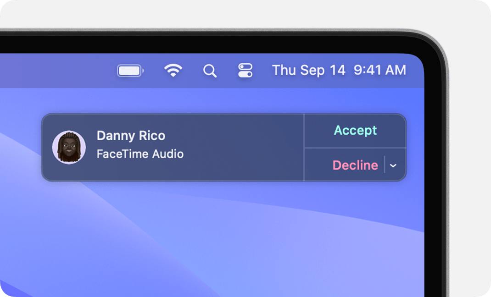
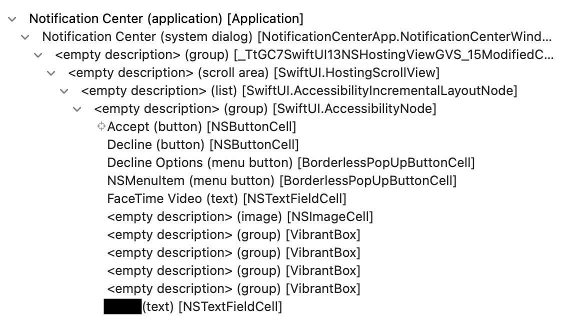
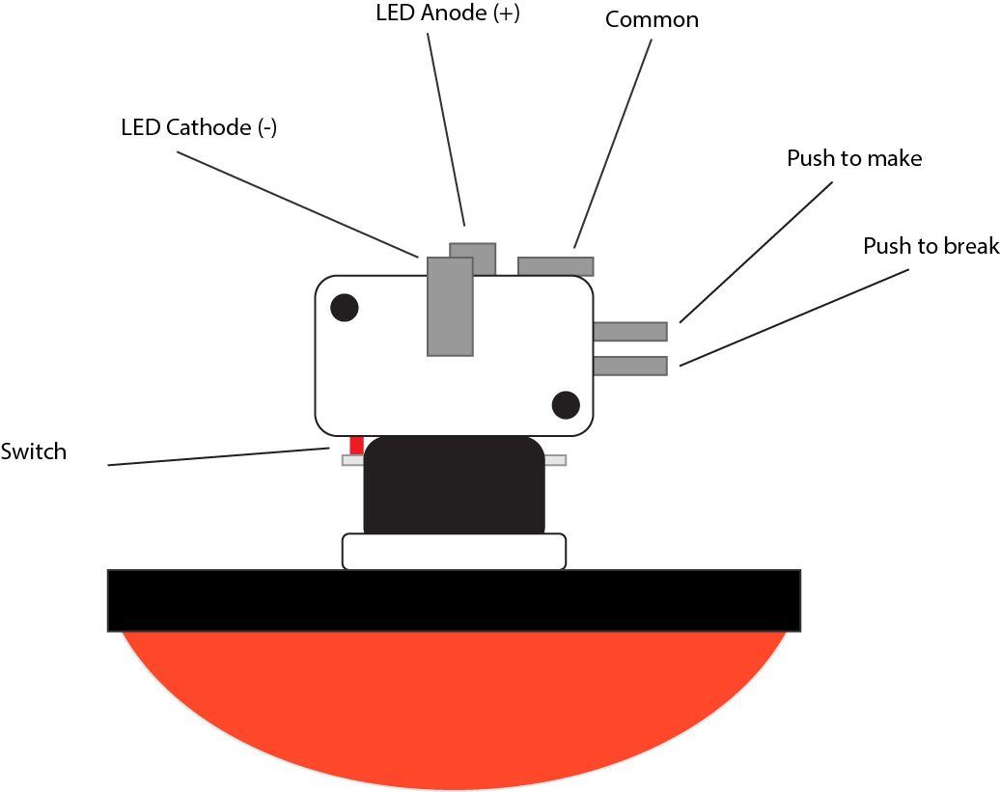
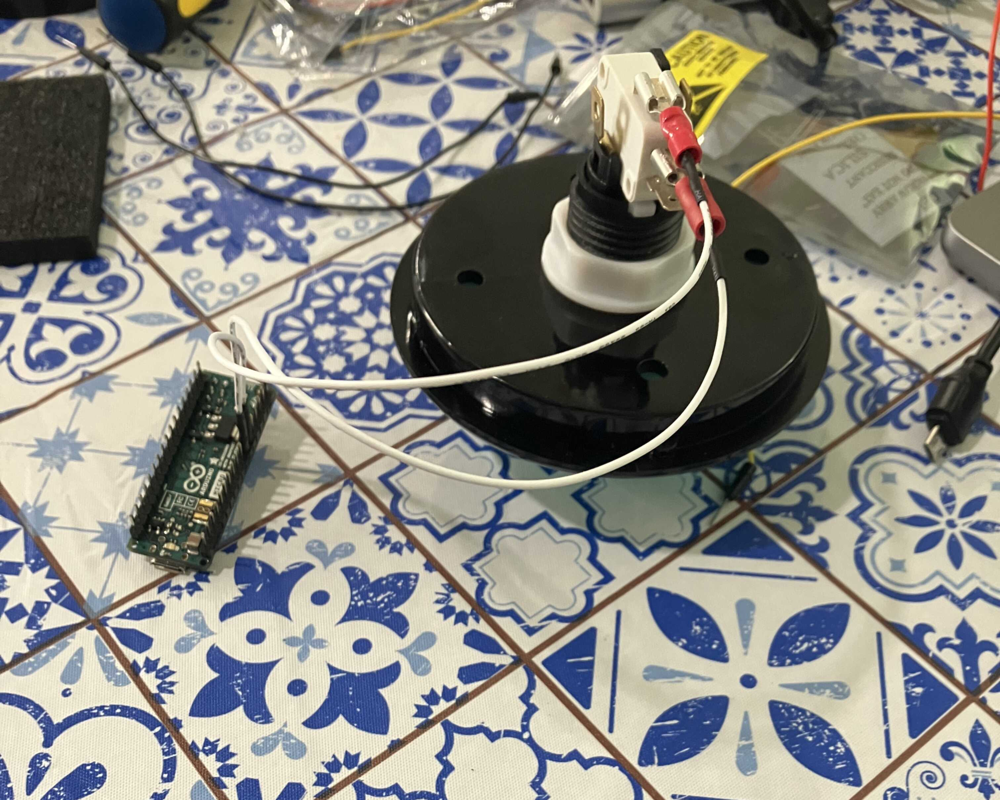
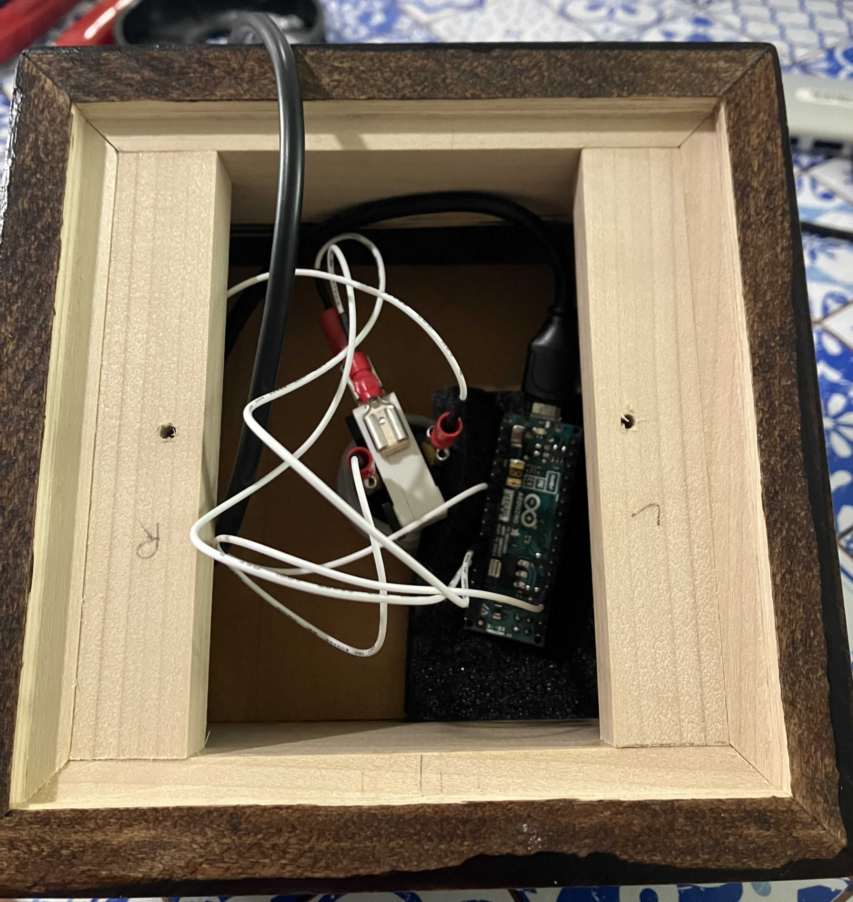
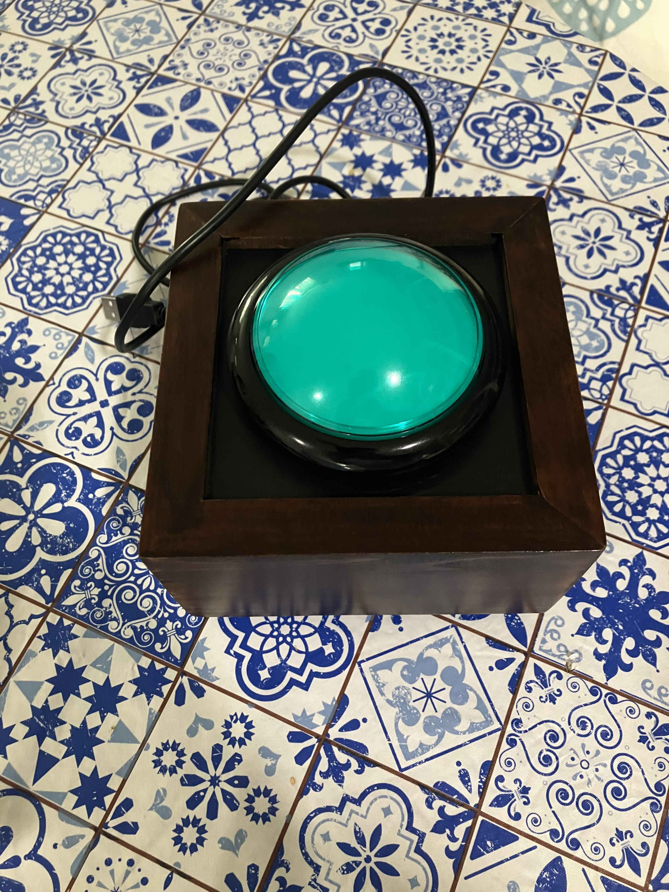

A family member of mine struggles to accept FaceTime calls from the computer. 
Imagine if you had limited mobility or physical dexterity and wanted to answer a
FaceTime call on a Mac. You need to be able to physically move a mouse or
trackpad cursor over to a (pretty small) "Accept" button and click on it. I
mean, just look at the tiny size of this thing:



I took this screencap [directly from Apple!][screencap]

What if instead you could just mash a giant physical button? Here's one sort-of
ridiculous way of making this work.

# Step 1: Automate the click

Something I didn't know but probably should have is that MacOS comes with an
application called ["Shortcuts"][shortcuts], a pretty powerful automation tool.
You can wire it up to do all sorts of different things with different MacOS
applications with its somewhat convoluted if-this-then-that interface. You can
control a lot of the built-in applications with Shortcuts with varying levels of
built-in control. The Notes app, for example, supports Shortcuts for all sorts
of things like `Append to a Note` or `Move a Note to a Folder`. FaceTime,
however, only supports making outbound calls via Shortcuts. This could be
useful, but we're trying to get to the opposite: answering a call.

However, Shortcuts can also be used to trigger arbitrary AppleScript commands.
[AppleScript][applescript] is a language included on MacOS that provides a way
of automating tasks. It has a sort of goofy english-esque syntax that you use to
boss your computer around. Here's the sample from the documentation that counts
up the number of files in the `Applications` directory:

```
tell application "Finder"
    if folder "Applications" of startup disk exists then
        return count files in folder "Applications" of startup disk
    else
        return 0
    end if
end tell
```

Some MacOS applications have pretty nice integrations with AppleScript, but the
project seems to have largely been abandoned in favor of things like Automator
and Shortcuts. [Wikipedia][applescript-wiki] has a nice history. In any case,
Facetime does not have nice integrations with AppleScript, so we have to abandon
that and just attempt to automate clicking on buttons on the display instead.
Without further ado, here's an AppleScript to click on that tiny `Accept`
button:

```
tell application "Shortcuts"
  tell application "System Events"
    delay 0.1
    set acceptButton to a reference to button "Accept" of group 1 of UI element 1 of scroll area 1 of group 1 of window 1 of application process "NotificationCenter"
    if acceptButton exists then
      click acceptButton
      delay 2
      repeat while exists (window 1 of process "FaceTime")
        delay 30
      end repeat
    end if
  end tell
end tell
```

What in the world does this do? Well:

1. `tell application "System Events"` scopes our commands to the "System Events"
   application, a place where non-GUI functions can be executed (like entering a
   keystroke, etc)
2. `delay 0.1` waits for 100ms to give FaceTime time to render the button
3. The next big giant block finds the `Accept` button. It lives in a big element
   hierarchy:
   `NotificationCenter > window > group > scroll area > UI element > button`.
   The way I figured this out was by using the [XCode Accessability
   Inspector][inspector] and working backwards through the display hierarchy:

   

   One big caveat here is that this definitely not future-proof. This element
   hierarchy worked for Sonoma, but inspecting it again for Sequoia shows some
   pretty large differences in the layout. In this case, the people I am
   building the button for aren't planning on upgrading, but it is something to
   keep in mind.

4. The rest is just waiting for the button to exist, clicking on it, and then
   keeping the script running for as long as FaceTime is open. For some reason I
   had to do that or FaceTime would just close randomly which was very
   frustrating.
5. We also wrap up the whole thing up in a `tell application "Shortcuts"` to try
   and scope down what applications we allow to control our computer via
   Accessibility settings.

So now that we have our AppleScript, we can bind it into our Shortcuts
application and [give it a keyboard shortcut][keyboard-shortcut]! I chose
&#8984;&#8963;&#8997;8 basically at random.

# Step 2: Automate the keyboard command

Now that we have a (terrible) way of clicking on a tiny button by instead
pressing a ton of keys together at the same time, let's automate the pressing of
the keys!

You can use a microcontroller to emulate a USB keyboard and have it send the
keys in question based on a relevant signal. Since I knew basically nothing
about hardware going into this mess, I used an [Arduino Micro][micro], though
you could probably do the same thing with something a bit smaller and cheaper.

One nice thing about using Arduino is that there are good instructions and
guides for getting started and writing your first Arduino sketches. The Arduino
website has some [good tutorials][getting-started]. Here's what I came up with
for sending keystrokes programatically to a computer:

```cpp
#include <Keyboard.h>
int btnPin = 2;

bool currentlyPlaying = false;

void setup() {
  pinMode(btnPin, INPUT_PULLUP);
  Keyboard.begin();
}

void loop() {
  if (digitalRead(btnPin) == HIGH) {
    currentlyPlaying = false;
  }

  if (digitalRead(btnPin) == LOW && !currentlyPlaying) {
    currentlyPlaying = true;
    Keyboard.press(KEY_LEFT_GUI);
    Keyboard.press(KEY_LEFT_ALT);
    Keyboard.press(KEY_LEFT_CTRL);
    Keyboard.press('8');
    Keyboard.releaseAll();
  }

  delay(500);
}
```

Basically, we:

1. Set up the [Keyboard library][keyboard]
2. Wait for a signal to come in on pin 2
3. Press all of the keys needed at the same time
4. Stop once the button is released.

With this, you can automatically send whatever combination of keys to the
computer whenever you get a signal on a given pin.

# Step 3: Make a big button

Now that we've carefully set up all the pieces of our machine, we can bring them
together using a giant button. I got [one of these][button]. It makes an
extremely satisfying "chunk" sound when pressed. The next step was to wire
everything up. Here's a small diagram of how this button works:



Essentially, we want to run a wire from the "push to make" into the Arduino at
pin 2, and then a wire from the arduino ground pin to the "common" terminal on
the button. Here's what that looks like all wired up (sorry for the extremely
blurry photo):



One note here is that the button itself has an LED on it, so if you were
interested you could also wire in some LED stuff but I just didn't in the end.

I was also very lucky to get a beautiful wooden enclosure built and stained by
my wonderful and talented father.



And here it is all finished:



# Recap

So, what happens when you push this button?

1. The `digitalRead` signal fires on the Arduino, sending &#8984;&#8963;&#8997;8
   as a keyboard signal.
2. That keyboard combination starts a MacOS "Shortcut" which triggers an
   AppleScript
3. The AppleScript searches for the "Accept" button on an inbound FaceTime call
   and clicks on it.
4. You talk on FaceTime.

Is it brittle? Yes. Is it hacky? Yes. Does it work? Yes.

[screencap]: https://support.apple.com/en-us/102215#answer
[shortcuts]: https://support.apple.com/guide/shortcuts-mac/intro-to-shortcuts-apdf22b0444c/mac
[applescript]: https://developer.apple.com/library/archive/documentation/AppleScript/Conceptual/AppleScriptLangGuide/introduction/ASLR_intro.html
[applescript-wiki]: https://en.wikipedia.org/wiki/AppleScript
[keyboard-shortcut]: https://support.apple.com/guide/shortcuts-mac/launch-a-shortcut-from-another-app-apd163eb9f95/mac#apd94a0e7c32
[inspector]: https://developer.apple.com/documentation/accessibility/accessibility-inspector
[micro]: https://store.arduino.cc/products/arduino-micro
[getting-started]: https://docs.arduino.cc/learn/programming/sketches/
[button]: https://www.sparkfun.com/big-dome-pushbutton-green.html
[keyboard]: https://docs.arduino.cc/language-reference/en/functions/usb/Keyboard/#functions
